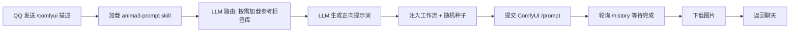

# astrbot-plugin-comfyui

AstrBot ComfyUI 文生图插件（Anima3）。在 QQ 等平台发送生图要求，插件调用 `anima3-prompt` skill 交给 LLM 生成 Anima3 正向提示词，注入 ComfyUI 工作流并生成图片，最后将图片返回聊天。

## 流程



## 安装与依赖

- 需要已运行的 ComfyUI，并安装以下自定义节点 / 模型：
  - 自定义节点：`AnimaMultiLoraLoader`、`AnimaDAVE`、`easy cleanGpuUsed`（[ComfyUI-Easy-Use](https://github.com/yolain/ComfyUI-Easy-Use)）
  - 模型：`Anima-2.9B-preview-v1.safetensors`、`qwen_3_06b_base.safetensors`、`anima-turbo-lora-v0.2.safetensors`、`qwen_image_vae.safetensors`、`dave_alpha.npz`
- AstrBot 需已配置可用的对话模型（用于生成提示词）。

## 使用

发送：

```
/comfyui 一位穿着白色连衣裙的少女站在樱花树下
```

或使用别名（`/生图`）：

```
/生图 一位穿着白色连衣裙的少女站在樱花树下
```

## 工作流管理（增 / 删 / 改 / 选）

工作流以 JSON 文件形式存放在数据目录中，**安装插件后直接在项目目录里手动操作即可**，无需通过聊天上传。

目录：

```
data/plugin_data/astrbot_plugin_comfyui/
├── workflows/            # 所有工作流都放在这里
│   ├── anima.json        # 默认工作流（首次加载自动复制，勿直接编辑插件目录里的 anima.json）
│   └── my_workflow.json  # 你手动添加的工作流
└── active_workflow.json  # 当前激活的工作流（可手动编辑，也可用命令切换）
```

### 增加 / 修改 / 删除

- **增加**：把工作流 JSON（API 格式，即含 `class_type` / `inputs` 的节点字典）复制到 `workflows/` 目录，命名如 `my_workflow.json`。
- **修改**：直接编辑 `workflows/` 下对应文件（改模型、参数、提示词等）。
- **删除**：直接删除对应文件。若删除的是当前激活的工作流，插件会自动回退到 `anima.json`。

> 如何从 ComfyUI WebUI 导出 API 格式：画布中右键 → Export → API（或 `Shift+Enter` 旁的菜单），保存为 JSON 后放入 `workflows/`。

### 指定正向提示词节点

每个工作流需明确哪个节点接收 LLM 生成的正向提示词。推荐在对应 `CLIPTextEncode` 节点的 `_meta` 中加标记：

```json
"6": {
  "inputs": { "text": "", "clip": ["2", 0] },
  "class_type": "CLIPTextEncode",
  "_meta": { "title": "CLIP文本编码", "is_positive_prompt": true }
}
```

未标记时回退到配置项 `prompt_node_id`（默认 `6`）。`_meta` 字段会被 ComfyUI 忽略，不影响执行。

### 选择当前使用的工作流

方式一（手动）：编辑 `active_workflow.json`：

```json
{ "workflow": "my_workflow.json" }
```

方式二（聊天命令，`workflow` 指令组）：

```
/workflow list            # 列出所有工作流，并标注当前
/workflow use <文件名>     # 切换，例如 /workflow use my_workflow.json
/workflow show            # 显示当前激活工作流与相关配置
```

## 测试工作流（导入并运行）

在接入 AstrBot 之前，建议先单独验证 ComfyUI 工作流能否跑通，有以下两种方式（已实测可用）：

### 方式一：命令行直接跑图（无需浏览器）

`scripts/test_comfyui.py` 会把 `anima.json` 提交给 ComfyUI 并下载生成结果，只依赖 Python 标准库（无需 `httpx`）：

```bash
# 在插件目录下执行
python scripts/test_comfyui.py

# 自定义服务器 / 提示词 / 输出目录
python scripts/test_comfyui.py --server http://127.0.0.1:8188 --prompt "1girl, sakura" --out test_output
```

运行结束后会打印本地图片路径，并给出可在浏览器直接打开的 `/view` 链接。

### 方式二：导入 ComfyUI WebUI 画布（可视化）

`anima.json` 是 API 格式，ComfyUI 前端（≥ 1.0 版本）支持直接导入并自动转换为可视化节点图：

- 把 `anima.json` 拖拽到 WebUI 画布上；或
- 在 WebUI 中按 `Ctrl+O`（或菜单 Workflow → Open）选择 `anima.json`。

导入后在画布中可直接修改参数并点击「运行」测试，也可以另存为 UI 格式工作流复用。

## 配置

在 AstrBot WebUI -> 插件设置 中可修改：

| 配置项 | 说明 | 默认值 |
| --- | --- | --- |
| `comfyui_server_url` | ComfyUI HTTP API 地址 | `http://127.0.0.1:8188` |
| `prompt_node_id` | 工作流未标记 `_meta.is_positive_prompt` 时的正向提示词节点 ID（兜底） | `6` |
| `timeout` | 等待 ComfyUI 生成的最长时间（秒） | `300` |
| `llm_provider_id` | 生成提示词的模型 Provider ID，留空则使用当前会话模型 | 空 |

> 当前激活的工作流由 `data/plugin_data/astrbot_plugin_comfyui/active_workflow.json` 决定，不在此配置中。

## 文件结构

```
astrbot_plugin_comfyui/
├── main.py             # 插件入口与流程编排
├── comfy_client.py     # ComfyUI HTTP 客户端
├── prompt_engine.py    # skill + LLM 提示词生成（渐进式加载）
├── anima.json          # 默认工作流源文件（首次运行复制到 workflows/）
├── _conf_schema.json   # WebUI 配置 schema
├── scripts/
│   └── test_comfyui.py # 命令行跑图测试脚本（仅标准库）
└── skills/anima3-prompt/  # 提示词生成技能
```

运行时工作流存储于 `data/plugin_data/astrbot_plugin_comfyui/workflows/`（默认 `anima.json` 首次加载自动从插件目录复制），当前激活的工作流由同目录下 `active_workflow.json` 指定。如需恢复默认工作流，删除 `workflows/anima.json` 并重载插件即可。

