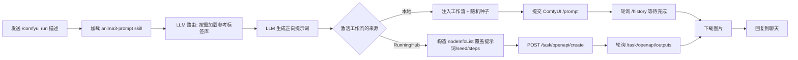

# astrbot-plugin-comfyui

AstrBot ComfyUI 文生图插件（Anima3）。在 QQ 等平台发送生图要求，插件调用 `anima3-prompt` skill 交给 LLM 生成 Anima3 正向提示词，注入工作流并生成图片，最后将图片返回聊天。支持两种执行后端：

- **本地 ComfyUI**：提交到本机 ComfyUI（默认）。
- **RunningHub 云端**：把已上传到 RunningHub 的工作流通过其 OpenAPI 在云端执行，无需本地 GPU / ComfyUI。

## 流程



## 安装与依赖

- **本地 ComfyUI 后端**：需要已运行的 ComfyUI，并安装以下自定义节点 / 模型：
  - 自定义节点：`AnimaMultiLoraLoader`、`AnimaDAVE`、`easy cleanGpuUsed`（[ComfyUI-Easy-Use](https://github.com/yolain/ComfyUI-Easy-Use)）
  - 模型：`Anima-2.9B-preview-v1.safetensors`、`qwen_3_06b_base.safetensors`、`anima-turbo-lora-v0.2.safetensors`、`qwen_image_vae.safetensors`、`dave_alpha.npz`
- **RunningHub 云端后端**：无需本地 ComfyUI / GPU，只需 RunningHub API Key 与已上传的工作流（见「RunningHub 云端后端」）。
- AstrBot 需已配置可用的对话模型（用于生成提示词）。

## 使用

发送（`run` 子命令，别名 `生图`）：

```
/comfyui run 一位穿着白色连衣裙的少女站在樱花树下
```

或使用别名：

```
/comfyui 生图 一位穿着白色连衣裙的少女站在樱花树下
```

> 插件会先回复「正在使用工作流 … 生成图片」，完成后把生成的图片**回复到触发消息**。

### 回复改图

对机器人最近生成的某张图，**回复该消息**并发送 `/改图 <修改描述>`，即可基于原提示词改写后重新出图（例如「换成红色背景」「加上雨天氛围」）。仅对本插件最近生成、且仍在历史窗口内（默认 30 条）的结果有效。

## 工作流管理（增 / 删 / 改 / 选）

本地工作流以 JSON 文件形式存放在数据目录中，**安装插件后直接在项目目录里手动操作即可**，无需通过聊天上传。RunningHub 云端工作流则通过配置登记（见下文「RunningHub 云端后端」）。

目录：

```
data/plugin_data/astrbot_plugin_comfyui/
├── workflows/            # 所有本地工作流都放在这里
│   ├── anima.json        # 默认工作流（首次加载自动复制，勿直接编辑插件目录里的 anima.json）
│   └── my_workflow.json  # 你手动添加的工作流
└── active_workflow.json  # 当前激活的工作流（可手动编辑，也可用命令切换）
```

### 增加 / 修改 / 删除

- **增加**：把工作流 JSON（API 格式，即含 `class_type` / `inputs` 的节点字典）复制到 `workflows/` 目录，命名如 `my_workflow.json`。
- **修改**：直接编辑 `workflows/` 下对应文件（改模型、参数、提示词等）。
- **删除**：直接删除对应文件。若删除的是当前激活的工作流，插件会自动回退到第一个受支持的本地工作流。

> 如何从 ComfyUI WebUI 导出 API 格式：画布中右键 → Export → API（或 `Shift+Enter` 旁的菜单），保存为 JSON 后放入 `workflows/`。

### 指定正向提示词节点

每个工作流需明确哪个节点接收 LLM 生成的正向提示词。插件通过 `_meta.title == "Prompts"` **且** `class_type == "CLIPTextEncode"` 的节点来定位它，例如：

```json
"6": {
  "inputs": { "text": "", "clip": ["2", 0] },
  "class_type": "CLIPTextEncode",
  "_meta": { "title": "Prompts" }
}
```

找不到这样的节点时，该工作流会被标记为「不受支持」并无法激活。`_meta` 字段会被 ComfyUI 忽略，不影响执行。

### 选择当前使用的工作流（聊天命令）

```
/comfyui workflow list            # 列出所有工作流（本地 + RunningHub），标注（当前）/（不受支持）
/comfyui workflow use <名称>       # 切换激活工作流，例如 /comfyui workflow use anima.json
```

`use` 按显示名或 key 匹配；RunningHub 条目可省略「（RunningHub）」后缀。也可手动编辑 `active_workflow.json`：

```json
{ "workflow": "anima.json", "source": "local" }
```

其中 `source` 为 `local`（本地 ComfyUI）或 `runninghub`（云端）。

## RunningHub 云端后端

不想在本机跑 ComfyUI / GPU 时，可以把工作流上传到 [RunningHub](https://www.runninghub.cn)，由插件通过其 OpenAPI 在云端执行。激活的工作流是哪一个就路由到对应后端：本地工作流走本地 ComfyUI，RunningHub 工作流走云端 API。

### 前置条件

1. 注册 RunningHub 账号并创建 **API Key**（企业级-共享 / 消费级-会员 key 均可用于工作流 API）。
2. 在 RunningHub 网站上上传你的 ComfyUI 工作流，得到数字 **webappId**——它出现在工作流页面地址栏里：`runninghub.cn/ai-detail/<webappId>`。
3. **该工作流必须先在网页上成功运行过一次**，之后才能通过 API 调用（否则会报 `NO_NODES`）。

> RunningHub 没有「列出我自己上传的工作流」的公开 API，因此需要你在配置里手动登记每个工作流的别名与 webappId。

### 配置

在 AstrBot WebUI -> 插件设置中填写：

| 配置项 | 说明 |
| --- | --- |
| `runninghub_api_key` | RunningHub API Key；留空则不启用云端，仅用本地 ComfyUI |
| `runninghub_base_url` | 服务地址，默认 `https://www.runninghub.cn` |
| `runninghub_prompt_field` | 注入正向提示词时匹配的节点字段名（fieldName），默认 `text` |
| `runninghub_workflows` | 「别名 → webappId」键值对**列表**，登记你的云端工作流 |

`runninghub_workflows` 示例（可登记任意多个）：

```json
[
  { "alias": "anima3",   "workflow_id": "1877265245566922800" },
  { "alias": "my-anime", "workflow_id": "123" }
]
```

登记后，这些工作流会出现在 `/comfyui workflow list` 中并带「（RunningHub）」后缀，用 `/comfyui workflow use <别名>` 激活即可。

### 执行细节

插件通过 `apiCallDemo` 拉取该 webappId 的可修改节点列表，然后构造 `nodeInfoList` 覆盖：

- 第一个 `fieldName == runninghub_prompt_field`（默认 `text`）的文本节点 → 注入「质量前缀 + LLM 正向提示词」；
- 所有 `KSampler` 节点的 `seed` / `steps` → 随机种子与配置的采样步数。

其余节点保持工作流原值（负向提示词等不受影响）。提交后轮询 `/task/openapi/outputs`，完成后直接下载返回的图片 URL。

## 测试工作流（导入并运行）

在接入 AstrBot 之前，建议先单独验证 ComfyUI 工作流能否跑通，有以下两种方式（已实测可用）：

### 方式一：命令行直接跑图（无需浏览器）

`scripts/test_comfyui.py` 会把 `anima.json` 提交给 ComfyUI 并下载生成结果，只依赖 Python 标准库（无需 `httpx`）：

```bash
# 在插件目录下执行
python scripts/test_comfyui.py

# 自定义服务器 / 提示词 / 输出目录
python scripts/test_comfyui.py --server http://127.0.0.1:8188 --prompt "1girl, sakura" --out test_output
```

运行结束后会打印本地图片路径，并给出可在浏览器直接打开的 `/view` 链接。

### 方式二：导入 ComfyUI WebUI 画布（可视化）

`anima.json` 是 API 格式，ComfyUI 前端（≥ 1.0 版本）支持直接导入并自动转换为可视化节点图：

- 把 `anima.json` 拖拽到 WebUI 画布上；或
- 在 WebUI 中按 `Ctrl+O`（或菜单 Workflow → Open）选择 `anima.json`。

导入后在画布中可直接修改参数并点击「运行」测试，也可以另存为 UI 格式工作流复用。

## 配置

在 AstrBot WebUI -> 插件设置 中可修改：

| 配置项 | 说明 | 默认值 |
| --- | --- | --- |
| `comfyui_server_url` | ComfyUI HTTP API 地址（本地后端） | `http://127.0.0.1:8188` |
| `workflow_dir` | 本地工作流目录；留空则用插件数据目录下 `workflows/` | 空 |
| `timeout` | 等待生成的最长时间（秒），本地与云端通用 | `300` |
| `sampler_steps` | KSampler 采样步数 steps。默认 12（Anima turbo 推荐）；清晰度低可调到 20~28 | `12` |
| `llm_provider_id` | 生成提示词的模型 Provider ID，留空则使用当前会话模型 | 空 |
| `enable_character_search` | 涉及知名 IP 角色时联网查证形象（需 AstrBot 启用联网搜索） | `true` |
| `runninghub_api_key` | RunningHub API Key；留空则不启用云端后端 | 空 |
| `runninghub_base_url` | RunningHub 服务地址 | `https://www.runninghub.cn` |
| `runninghub_prompt_field` | 注入正向提示词时匹配的节点字段名（fieldName） | `text` |
| `runninghub_workflows` | 「别名 → webappId」键值对列表，登记云端工作流 | `[]` |

> 当前激活的工作流由 `data/plugin_data/astrbot_plugin_comfyui/active_workflow.json` 决定，不在此配置中。

## 文件结构

```
astrbot_plugin_comfyui/
├── main.py             # 插件入口与流程编排（含本地 / RunningHub 后端路由）
├── comfy_client.py     # ComfyUI HTTP 客户端 + RunningHub OpenAPI 客户端
├── prompt_engine.py    # skill + LLM 提示词生成（渐进式加载）
├── anima.json          # 默认工作流源文件（首次运行复制到 workflows/）
├── _conf_schema.json   # WebUI 配置 schema
├── scripts/
│   └── test_comfyui.py # 命令行跑图测试脚本（仅标准库）
└── skills/anima3-prompt/  # 提示词生成技能
```

运行时工作流存储于 `data/plugin_data/astrbot_plugin_comfyui/workflows/`（默认 `anima.json` 首次加载自动从插件目录复制），当前激活的工作流由同目录下 `active_workflow.json` 指定。如需恢复默认工作流，删除 `workflows/anima.json` 并重载插件即可。

